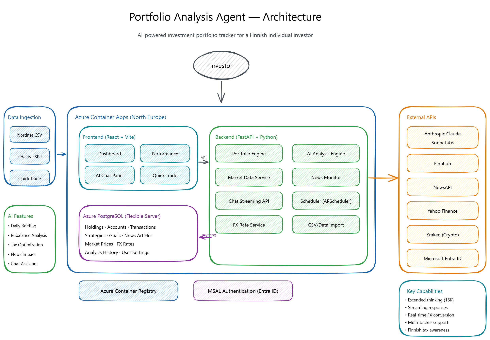

# Portfolio Analysis Agent

AI-powered investment portfolio tracker and analyzer for Finnish tax-aware accounts.

📖 See [`CHANGELOG.md`](CHANGELOG.md) for release history and [`AGENTS.md`](AGENTS.md) for the doc-update policy that keeps this README in sync with the code.



## Features

- **Real-time portfolio tracking** — Live prices via yfinance with automatic refresh
- **AI-powered analysis** — Daily summaries, rebalance recommendations, tax optimization (Claude)
- **Streaming AI chat** — Ask questions about your portfolio in natural language
- **Multi-broker support** — Nordnet, Fidelity, Kraken with CSV/PDF import
- **Finnish tax awareness** — Arvo-osuustili, OST, ESPP, and Crypto account types
- **Market news & alerts** — Price, earnings, rebalance, and news-triggered alerts
- **Investment goals** — Track progress toward financial targets
- **Mobile-responsive UI** — Works on desktop and mobile

## Tech Stack

| Layer | Stack |
|-------|-------|
| Backend | Python 3.12, FastAPI, SQLAlchemy 2.0, PostgreSQL |
| Frontend | React 19, TypeScript, Vite, Tailwind CSS, Recharts |
| Auth | Microsoft MSAL (Personal Account), JWT RS256 |
| AI | Anthropic Claude (streaming chat + scheduled analysis) |
| Market Data | yfinance, Finnhub, NewsAPI, Kraken API |
| Deployment | Backend: Docker + Azure Container Apps. Frontend: Azure Static Web Apps (Free tier). GitHub Actions CI/CD. |

## Architecture

```
┌──────────────────┐                  ┌──────────────────┐
│  React SPA       │  cross-origin    │   FastAPI        │
│  Azure Static    │ ───── HTTPS ───▶ │  Azure Container │
│  Web Apps (Free) │  (cookie auth)   │  Apps (Uvicorn)  │
└──────────────────┘                  └────────┬─────────┘
                                               │
                          ┌─────────────┬──────┼──────────────┐
                          │             │      │              │
                     ┌────▼───┐   ┌─────▼──┐   │   ┌──────────▼──┐
                     │ Claude │   │yfinance│   │   │  Scheduler  │
                     │  API   │   │ + News │   │   │(APScheduler)│
                     └────────┘   └────────┘   │   └─────────────┘
                                               │
                                        ┌──────▼──────┐
                                        │ PostgreSQL  │
                                        │  (Azure)    │
                                        └─────────────┘
```

## API Endpoints

| Route | Description |
|-------|-------------|
| `/api/v1/accounts` | Account management (CRUD) |
| `/api/v1/holdings` | Holdings with live prices, quick trades |
| `/api/v1/portfolio` | Portfolio summary, performance, allocation |
| `/api/v1/transactions` | Transaction history and management |
| `/api/v1/analysis` | AI insights: daily summary, rebalance, tax optimization |
| `/api/v1/chat` | Streaming AI chat grounded in portfolio context |
| `/api/v1/strategy` | Investment strategy and target allocation |
| `/api/v1/goals` | Investment goals tracking |
| `/api/v1/alerts` | Alert management (price, news, earnings) |
| `/api/v1/news` | Market news with impact analysis |
| `/api/v1/settings` | User settings and FX rate config |
| `/api/v1/upload` | CSV/PDF file import |

## Local Development

### Prerequisites

- Python 3.12+
- Node.js 22+
- Docker (optional, for containerized runs)

### Backend

```bash
cd backend
cp .env.example .env  # Configure API keys and DB
pip install -e .
alembic upgrade head
uvicorn app.main:app --reload --port 8000
```

### Frontend

```bash
cd frontend
npm install
npm run dev  # Starts on http://localhost:5173
```

### Environment Variables

Backend (`.env`):
- `DATABASE_URL` — PostgreSQL connection string (or omit for SQLite)
- `ANTHROPIC_API_KEY` — Claude API key for AI features
- `AZURE_CLIENT_ID` — Microsoft app registration for auth
- `FINNHUB_API_KEY` — Market news (optional)
- `NEWS_API_KEY` — News aggregation (optional)

## Deployment

Deployed automatically via GitHub Actions on push to `main`:

1. **Backend** — Docker image built and pushed to Azure Container Registry, then deployed to an Azure Container App.
2. **Frontend** — Vite builds `frontend/dist/` with `VITE_API_BASE_URL` baked in (from the `VITE_API_BASE_URL` repo Variable), then deployed to Azure Static Web Apps via `azure/static-web-apps-deploy@v1` using the `AZURE_STATIC_WEB_APPS_API_TOKEN` secret.

The frontend calls the backend cross-origin. CORS is configured via the `CORS_ORIGINS` env var on the backend Container App, and the auth cookie uses `SameSite=None; Secure` for cross-origin sessions.

### Azure Resources

- **Resource Group** with a `CanNotDelete` lock
- **Container App** running the FastAPI/Uvicorn backend
- **Static Web App** (Free tier) hosting the React frontend
- **Azure PostgreSQL Flexible Server** for portfolio data
- **Azure Container Registry** for backend images
- **Azure Key Vault** for secrets

## Project Structure

```
portfolio-analysis-agent/
├── backend/
│   ├── app/
│   │   ├── main.py              # FastAPI app entry point
│   │   ├── routers/             # API route handlers
│   │   ├── models/              # SQLAlchemy models
│   │   ├── services/            # Business logic (market data, AI, alerts)
│   │   ├── auth.py              # MSAL authentication
│   │   └── config.py            # Configuration
│   ├── alembic/                 # Database migrations
│   ├── tests/                   # Backend tests
│   ├── Dockerfile
│   └── pyproject.toml
├── frontend/
│   ├── src/
│   │   ├── pages/               # Route pages
│   │   ├── components/          # React components
│   │   ├── hooks/               # Custom hooks (React Query)
│   │   └── types/               # TypeScript types
│   └── package.json             # Built by Vite → deployed to Azure Static Web Apps
└── .github/workflows/deploy.yml # CI/CD pipeline
```
